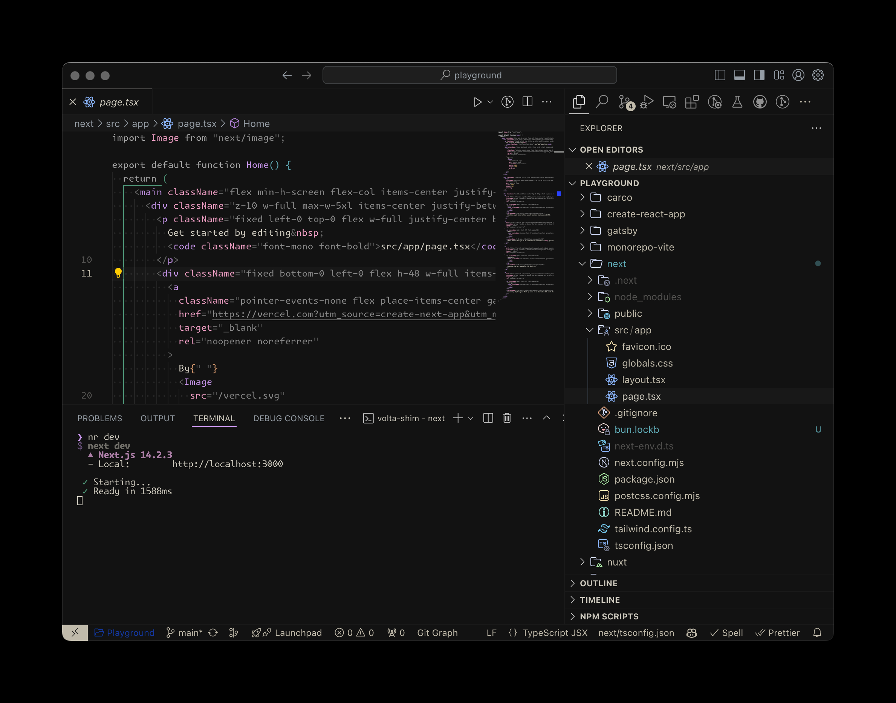

# Vesper Purple Theme for VSCode

## Installation

1. Open **Extensions** sidebar panel in Visual Studio Code.
2. Search for `Vesper Purple Theme`.
3. Click **Install** to install it.

## Credits

- Language examples are from [atom/language-examples](https://github.com/atom/language-examples).

## License

[MIT](./LICENSE)
